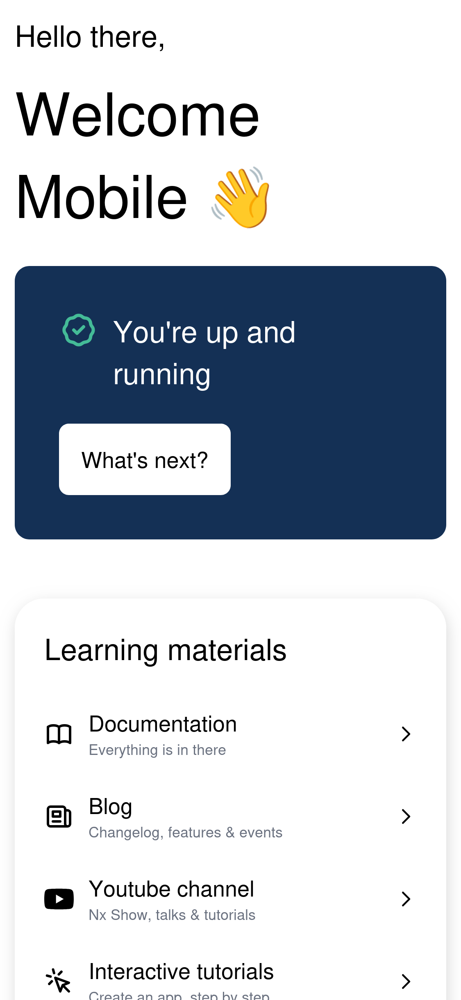

# Amplify Monorepo Nx Template

A monorepo template using AWS Amplify, Nx, and shadcn/ui for building scalable web and mobile applications.

- Web Application

  

- Mobile Application

  

## Prerequisites

- Node.js 18+
- npm or yarn
- AWS CLI configured
- Amplify CLI installed globally: `npm install -g @aws-amplify/cli`
- shadcn/ui CLI: `npx shadcn-ui@latest init`

## Tech Stack

- Nx
- Nextjs(App Route)
- React Native
- Shadcn UI
- AWS Amplify Gen 2
- Tailwind CSS
- i18next

## Quick Start

1. Clone the repository
2. Install dependencies: `npm install`
3. Configure Amplify: `amplify configure`
4. Initialize Amplify: `amplify init`

## Development

### Web Application

```bash
npx nx run @workspace/web:dev
```

### Mobile Application

```bash
npx nx run @workspace/mobile:dev
```

## Build

### Web

```bash
npx nx run @workspace/web:build
```

### Mobile

```bash
npx nx run @workspace/mobile:build
```

## Project Structure

```
├── apps/
│   ├── web/          # Web application
│   └── mobile/       # Mobile application
├── libs/             # Shared libraries
├── packages/
│   └── backend/
│       └── amplify/  # AWS Amplify configuration
└── nx.json           # Nx workspace configuration
```

## UI Components

### Adding shadcn/ui Components

```bash
npx shadcn@latest add button
npx shadcn@latest add card
npx shadcn@latest add input
```

update `shadcn/src/index.ts`

```
(CODE)
export * from './components/ui/button';
```

## Available Scripts

- `nx graph` - View project dependency graph
- `nx affected:build` - Build affected projects
- `nx affected:test` - Test affected projects

## Deploy on AWS Amplify

### Backend

1. Next packages in `/package.json` should be removed when deploying on Amplify in the first time

```
- "next": "~15.2.4",
```

2. Select repo and activate checkbox of this repo is a monorepo then key `packages/backend` in app path.

### Web

1. Added Next packages in `/package.json`.

```
+ "next": "~15.2.4",
```

2. Select repo and activate checkbox of this repo is a monorepo then key `apps/web` in app path.

## Refer

https://docs.amplify.aws/nextjs/deploy-and-host/fullstack-branching/monorepos/
